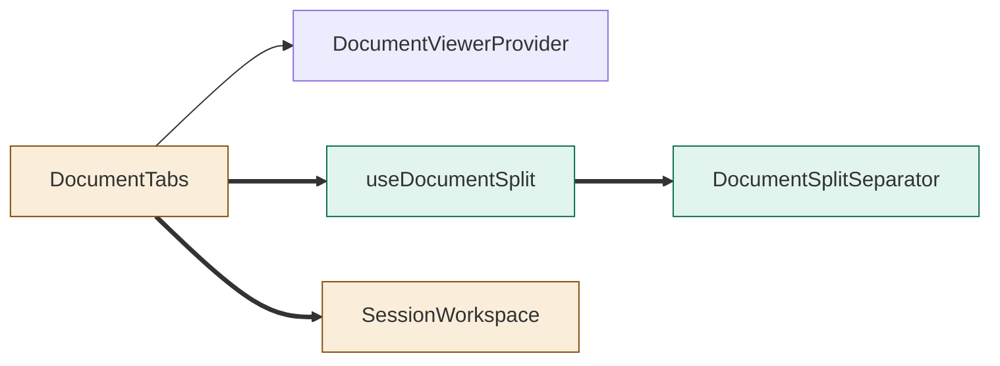
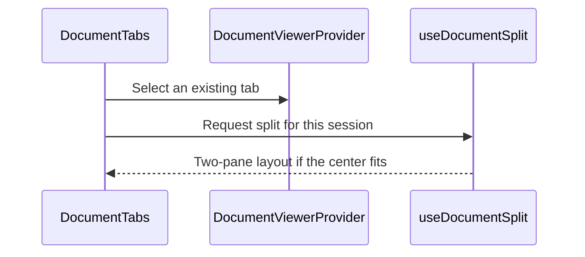
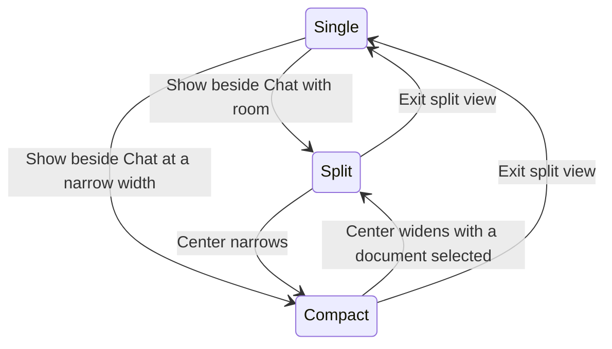

# TASK-2b0d7b76 diagrams

## Structure

Changed: DocumentTabs and SessionWorkspace. Added: useDocumentSplit and DocumentSplitSeparator. Reused: DocumentViewerProvider.

```mermaid
flowchart LR
    classDef added fill:#e1f5ee,stroke:#0f6e56
    classDef changed fill:#faeeda,stroke:#854f0b
    classDef removed stroke-dasharray:4 3
    tabs["DocumentTabs"]:::changed --> provider["DocumentViewerProvider"]
    tabs ==> layout["useDocumentSplit"]:::added
    layout ==> divider["DocumentSplitSeparator"]:::added
    tabs ==> chat["SessionWorkspace"]:::changed
```

## Sequence

```mermaid
sequenceDiagram
    participant T as DocumentTabs
    participant V as DocumentViewerProvider
    participant L as useDocumentSplit
    T->>V: Select an existing tab
    T->>L: Request split for this session
    L-->>T: Two-pane layout if the center fits
```

## State

```mermaid
stateDiagram-v2
    Single --> Split: Show beside Chat with room
    Single --> Compact: Show beside Chat at a narrow width
    Split --> Compact: Center narrows
    Compact --> Split: Center widens with a document selected
    Split --> Single: Exit split view
    Compact --> Single: Exit split view
```
