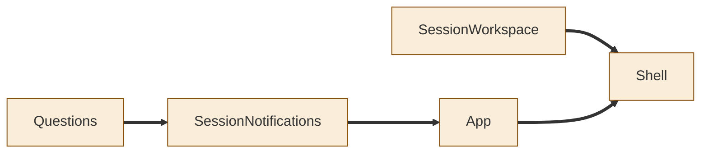
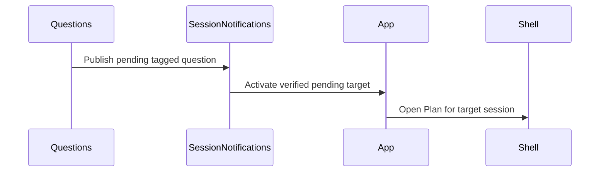
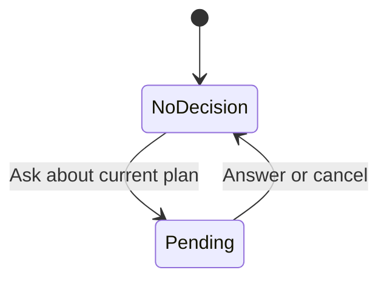

# TASK-a08dc465 diagrams

## Structure

Changed: SessionWorkspace, Shell, Questions, SessionNotifications and App.

```mermaid
flowchart LR
    classDef changed fill:#faeeda,stroke:#854f0b
    chat["SessionWorkspace"]:::changed ==> shell["Shell"]:::changed
    q["Questions"]:::changed ==> notice["SessionNotifications"]:::changed
    notice ==> app["App"]:::changed ==> shell
```

## Sequence

```mermaid
sequenceDiagram
    participant Q as Questions
    participant N as SessionNotifications
    participant A as App
    participant S as Shell
    Q->>N: Publish pending tagged question
    N->>A: Activate verified pending target
    A->>S: Open Plan for target session
```

## State

```mermaid
stateDiagram-v2
    [*] --> NoDecision
    NoDecision --> Pending: Ask about current plan
    Pending --> NoDecision: Answer or cancel
```
