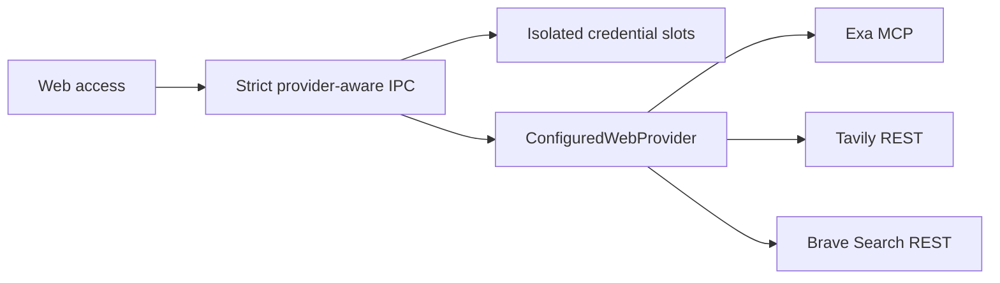
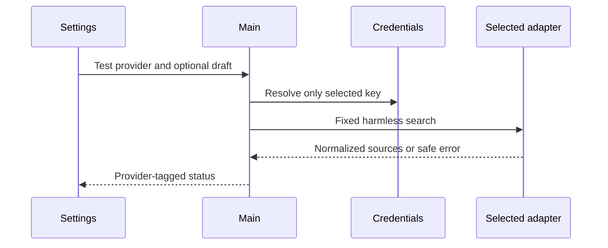
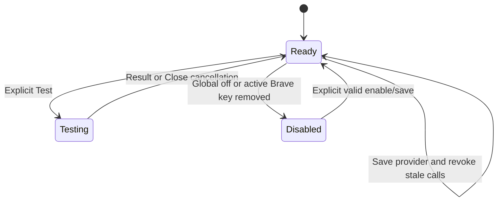

# Web providers

```mermaid
flowchart LR
 UI[Web access] --> IPC[Strict provider-aware IPC]
 IPC --> Keys[Isolated credential slots]
 IPC --> Gate[ConfiguredWebProvider]
 Gate --> Exa[Exa MCP]
 Gate --> Tavily[Tavily REST]
 Gate --> Brave[Brave Search REST]
```

```mermaid
sequenceDiagram
 participant U as Settings
 participant M as Main
 participant C as Credentials
 participant P as Selected adapter
 U->>M: Test provider and optional draft
 M->>C: Resolve only selected key
 M->>P: Fixed harmless search
 P-->>M: Normalized sources or safe error
 M-->>U: Provider-tagged status
```

```mermaid
stateDiagram-v2
 [*] --> Ready
 Ready --> Testing: Explicit Test
 Testing --> Ready: Result or Close cancellation
 Ready --> Ready: Save provider and revoke stale calls
 Ready --> Disabled: Global off or active Brave key removed
 Disabled --> Ready: Explicit valid enable/save
```
