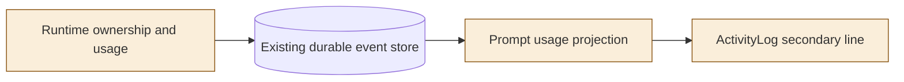
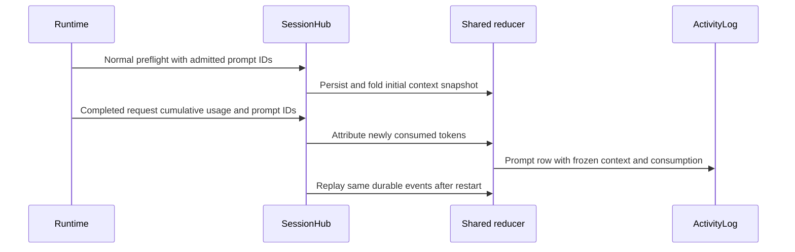
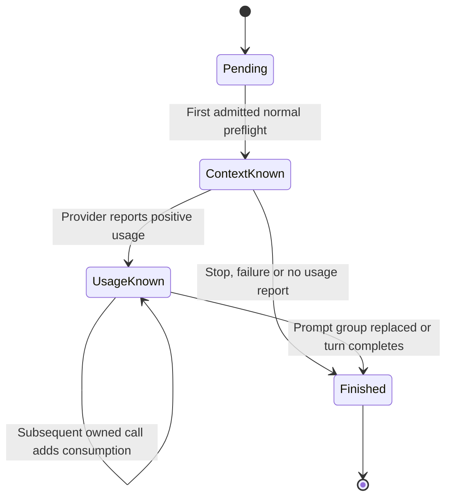

# TASK-ddc26c66 diagrams

Illustrates Design in TASK-ddc26c66.md.

## Structure
Node map: runtime, reducer and ActivityLog changed; event store reused unchanged.

```mermaid
flowchart LR
 classDef changed fill:#faeeda,stroke:#854f0b
 runtime[Runtime ownership and usage]:::changed --> store[(Existing durable event store)]
 store --> reducer[Prompt usage projection]:::changed
 reducer --> activity[ActivityLog secondary line]:::changed
```

## Sequence

```mermaid
sequenceDiagram
 participant R as Runtime
 participant S as SessionHub
 participant U as Shared reducer
 participant A as ActivityLog
 R->>S: Normal preflight with admitted prompt IDs
 S->>U: Persist and fold initial context snapshot
 R->>S: Completed request cumulative usage and prompt IDs
 S->>U: Attribute newly consumed tokens
 U->>A: Prompt row with frozen context and consumption
 S->>U: Replay same durable events after restart
```

## State

```mermaid
stateDiagram-v2
 [*] --> Pending
 Pending --> ContextKnown: First admitted normal preflight
 ContextKnown --> UsageKnown: Provider reports positive usage
 UsageKnown --> UsageKnown: Subsequent owned call adds consumption
 ContextKnown --> Finished: Stop, failure or no usage report
 UsageKnown --> Finished: Prompt group replaced or turn completes
 Finished --> [*]
```
