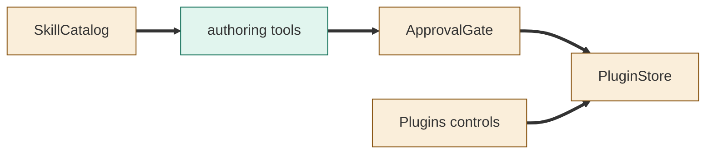
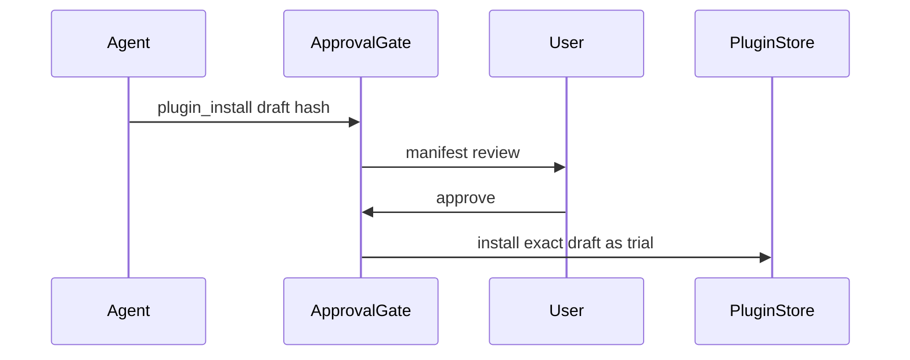
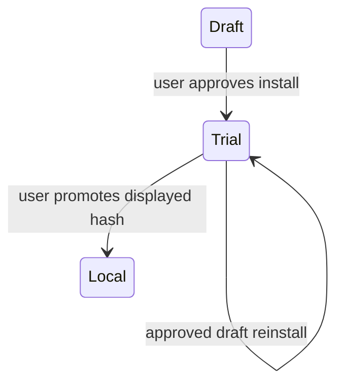

# TASK-e7a0e4d8 diagrams
Design is authoritative. Added: authoring tools. Changed: gate, store, skill catalog, desktop controls.
## Structure

```mermaid
flowchart LR
 classDef added fill:#e1f5ee,stroke:#0f6e56
 classDef changed fill:#faeeda,stroke:#854f0b
 classDef removed stroke-dasharray:4 3
 tools["authoring tools"]:::added ==> gate["ApprovalGate"]:::changed
 gate ==> store["PluginStore"]:::changed
 ui["Plugins controls"]:::changed ==> store
 skills["SkillCatalog"]:::changed ==> tools
```
## Sequence

```mermaid
sequenceDiagram
 participant Agent
 participant Gate as ApprovalGate
 participant User
 participant Store as PluginStore
 Agent->>Gate: plugin_install draft hash
 Gate->>User: manifest review
 User->>Gate: approve
 Gate->>Store: install exact draft as trial
```
## State

```mermaid
stateDiagram-v2
 Draft --> Trial: user approves install
 Trial --> Trial: approved draft reinstall
 Trial --> Local: user promotes displayed hash
```
