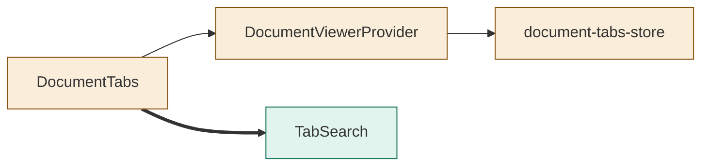
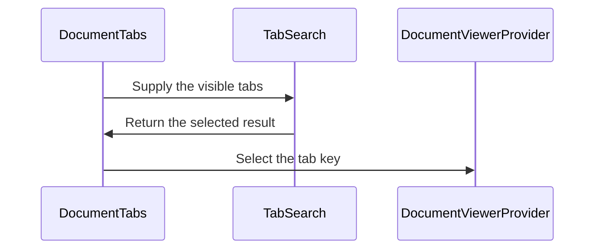
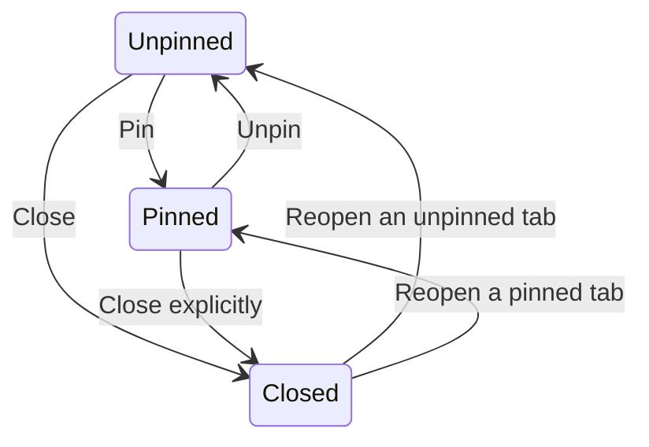

# TASK-ec507a39 diagrams

Illustrates Design in TASK-ec507a39.md.

## Structure

Changed: DocumentTabs, DocumentViewerProvider, document-tabs-store. Added: TabSearch.

```mermaid
flowchart LR
    classDef added fill:#e1f5ee,stroke:#0f6e56
    classDef changed fill:#faeeda,stroke:#854f0b
    classDef removed stroke-dasharray:4 3
    strip["DocumentTabs"]:::changed --> viewer["DocumentViewerProvider"]:::changed
    strip ==> search["TabSearch"]:::added
    viewer --> store["document-tabs-store"]:::changed
```

## Sequence

```mermaid
sequenceDiagram
    participant S as DocumentTabs
    participant Q as TabSearch
    participant V as DocumentViewerProvider
    S->>Q: Supply the visible tabs
    Q->>S: Return the selected result
    S->>V: Select the tab key
```

## State

```mermaid
stateDiagram-v2
    Unpinned --> Pinned: Pin
    Pinned --> Unpinned: Unpin
    Unpinned --> Closed: Close
    Pinned --> Closed: Close explicitly
    Closed --> Unpinned: Reopen an unpinned tab
    Closed --> Pinned: Reopen a pinned tab
```
